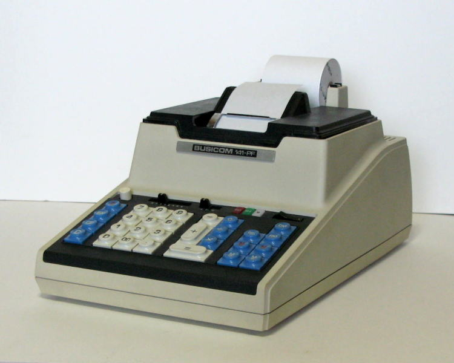
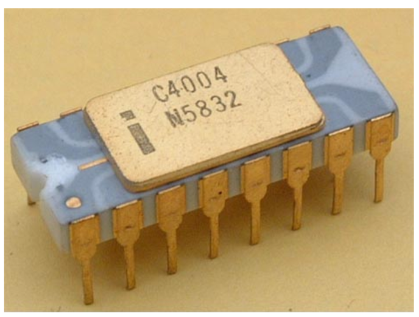

# MCS4_SYSTEM
This is a redesign of the MCS-4 System including 4004 CPU and an experience of Busicom 141-PF Calculator. 
Detail technical information over 100pages is described in doc/MCS4_System_TRM.pdf. 

## Recreation of the Busicom 141-PF Calculator
The MCS-4 chipset, comprising the 4004 (CPU), 4001 (ROM), 4002 (RAM), and 4003 (shift register) are designed using Verilog HDL, and a complete MCS-4 system are constructed by integrating these chips. And the 141-PF calculator developed by Busicom Corporation are reproduced, with implementing it on an FPGA. 

 
Busicom Caculator 141-PF (http://www.dentaku-museum.com/calc/calc/10-busicom/busicomd/busicomd.html) 

 
Busicom Caculator 141-PF in FPGA 

## 4004 CPU
 
4004 CPU Chip (http://www.intel-vintage.info/intelmcs.htm) 

The 4004 is a 4-bit CPU core at the heart of the MCS-4 system. It fetches instructions from ROM, decodes the instruction code, and executes operations accordingly.
Each instruction cycle consists of 8 clock cycles, during which the CPU transitions sequentially through eight internal states: A1, A2, A3, M1, M2, X1, X2, and X3.
With a maximum operating frequency of 740 kHz, each instruction cycle lasts approximately 10.8 µs (minimum). Naturally, the 4004 does not utilize pipelined control;
instruction fetch, decode, and execution are processed one at a time in strict sequence. Below shows the pin layout and the signal functions of the 4004 CPU.  

 
4004 CPU Pinout 

## MCS-4 System and Caculator 141-PF
The user interfaces such as the calculator’s keyboard and printer are realized using a modern microcontroller based on the RISC-V architecture, combined with a UART terminal or a Touch LCD panel. Our goal is to thoroughly appreciate the functionality and internal architecture of the historically significant 141-PF calculator, which remains practically usable to this day and is exhibited in museums.

 
MCS-4 System Block Diagram 

 
How to use 141-PF 

## A challenge: Calculating 500 Digits of Pi with the 4004 CPU
I developed and executed a program in 4004 CPU assembly to compute 500 digits of the mathematical constant π using Machin's formula. Despite being the world’s first microprocessor developed during the dawn of microcontroller technology, the Intel 4004 exhibits surprisingly sufficient computational capability―even with its primitive instruction set.  
The total computation time at a clock speed of 750 KHz (4004 CPU) is approximately 17 minutes. The final result―500 digits of π―is printed by the 141-PF printer.  

## Firmware References
This project utilizes historical firmware related to the 141-PF calculator:
- [4001.code - Simulator with Flowchart](http://www.4004.com/assets/busicom-141pf-simulator-w-flowchart-071113.zip)  
- [Assembly Source – Busicom 141-PF Calculator](http://www.4004.com/2009/Busicom-141PF-Calculator_asm_rel-1-0-1.txt)

These resources are distributed under the following license, which this project inherits:
- [Creative Commons Attribution-NonCommercial-ShareAlike 2.5](https://creativecommons.org/licenses/by-nc-sa/2.5/legalcode)
 
